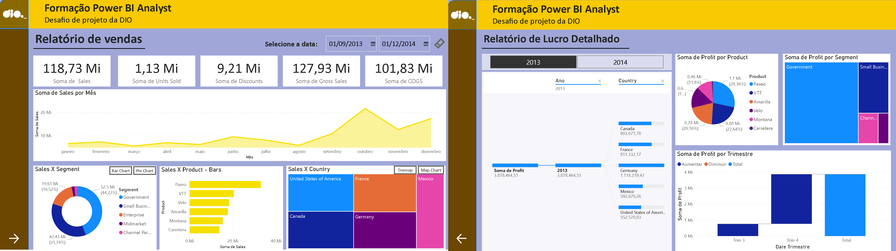

<h1>> 
 Projetos em Power BI 

<h2> Os relatórios feitos com amostras do PowerBI serão armazenados nesse repositório </h2>

`Portfólio` 

___

<h3> - Formação Power BI Analyst ( DIO ) </h3>

 Desafio de projeto da DIO que pedia um relatório usando um sample padrão do PowerBI 

___

